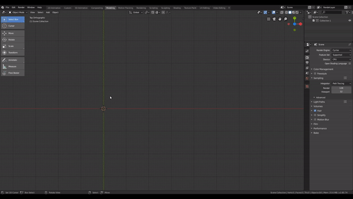
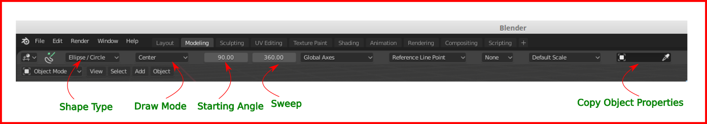
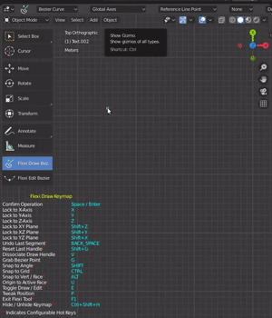
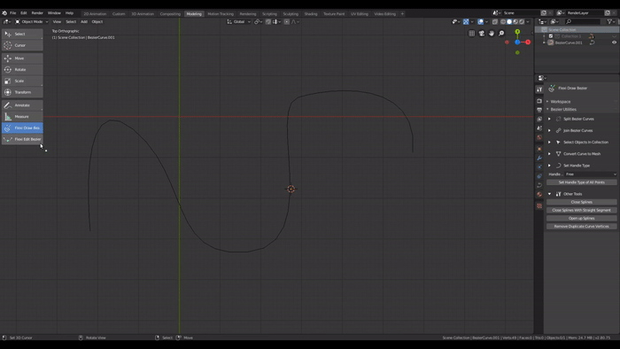
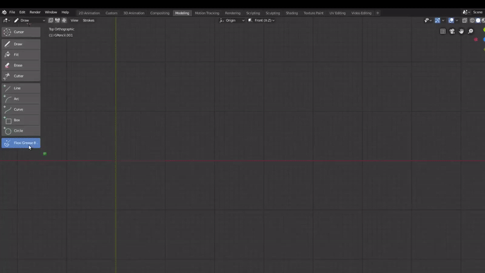
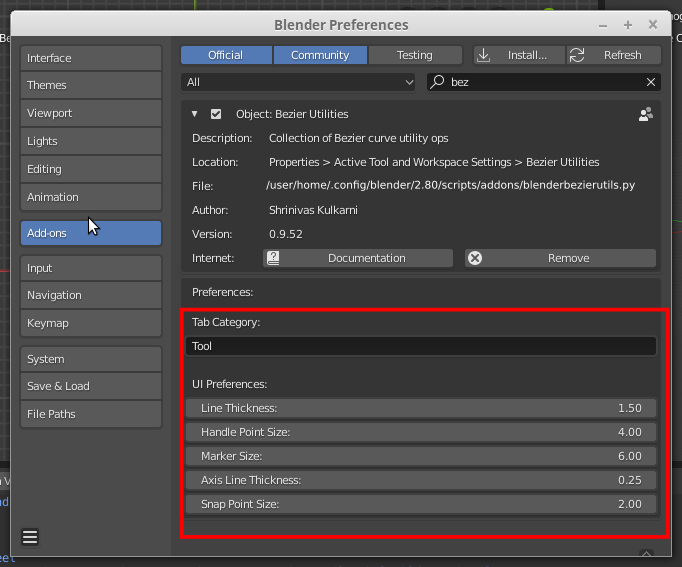

# Blender Add-on with Bézier Utility Operations

**Add-on Version:** 0.9.93

This add-on contains several tools and utility ops for working with Bézier curves.

Supported Blender Versions: **2.8x**

Video Tutorials: https://www.youtube.com/playlist?list=PLxsh4i5F_h9G6QFoPzKvBRMayz8533fSW

# Installation

- Download `blenderbezierutils.py` (save the file from [this location](https://raw.githubusercontent.com/Shriinivas/blenderbezierutils/master/blenderbezierutils.py) in a folder on disk.)
- Open Blender and select `File -> User Preferences`
- Click `install Add-ons` tab and then `Install Add-on from File`
- Select `blenderbezierutils.py` file
- Check the `Bézier Utilities` option in the add-ons dialog

After installation, a new tab: `Bézier Utilities` is displayed in Object and Edit modes on `Active Tool and Workspace settings` area on the properties panel.

There will also appear two new buttons - `Flexi Draw Bézier` and `Flexi Edit Bézier` - in `Object Mode` and a `Flexi Grease Bézier` button in GP Draw Mode on the toolshelf. 

# Overview

The tools `Flexi Draw`, `Flexi Edit` and `Flexi Grease` are interactive tools that allow drawing and editing Bézier curves.

## Flexi Draw Bézier Tool

This tool is available in object mode via a new button on the toolshelf (short cut to toggle the toolshelf - `T`). It allows drawing Bézier curves by manipulating the control points.

### Drawing Bézier Curve

To draw the curve, activate the tool by clicking the `Flexi Draw Bézier tool` on the toolshelf and select Bézier Curve from Shape Type drop-down. Click the `LMB` on the starting point of the curve. Then click and drag `LMB` on the end point to adjust the curvature. You can continue drawing subsequent segments in this fashion. Double clicking or hitting `Enter` or `Space` will convert the drawing to a curve object. You can auto-close the curve by pressing `Shift Space` or `Shift Enter`.

#### Repositioning the Bézier point

At the time of dragging the `LMB` to set the handle location, you can grab the Bézier point to reposition it by pressing `G` (configirable). All the snapping options are available for setting the handle location and repositioning the Bézier point. Press `G` again to release the grab.

#### Resetting Handle

You can reset the handle if you need to draw a straight line after a curved segment by pressing the hot key `Shift G` (configurable).

#### Dissociating Handle

While adjusting the handle by dragging the mouse pointer, you can change the handle type to free by pressing the hot-key `V`. This allows creating cusp nodes, even while creating the curve.

#### Undo

While drawing, you can undo one segment at a time by pressing backspace. Pressing escape removes the entire curve. After the drawing is finished, the curve creation can be undone by pressing `Ctrl Z`

### Drawing Primitive Shapes

Other than Bézier curve you can also create primitive shapes with Bézier segments. To do this, select the appropriate primitive shape from the Shape Type drop-down in the tollbar at the top.

The shapes currently available are:

1. Rectangle
2. Ellipse / Circle
3. Polygon
4. Star

Click the starting point and end point of the shape. To draw shapes with equal height and width (e.g. perfect circle or square), hold down `Shift` key. You can optionally snap to the grid.

The shapes are all 2D, so for drawing in the 3D perspective view, you can either choose a constraining plane or set the orientation to view. In perspective view, without any constraining plain, the depth value of the current mouse location is applied to all the points.

#### Adjusting number of segments (Ellipse) or Sides (Polygon / Star)

To adjust the segment count or sides use the `mouse wheel` or `Numpad +` and `Numpad -` keys. You may also directly type the value in the edit box on toolbar.

#### Drawing from Center or from Corner

You can start the drawing either from the corner (Bounding Box) or from the center by choosing appropriate option in the **Drawing Mode** drop-down.

#### Sweep (Available in Ellipse / Circle, Polygon and Star)

The sweep angle can be entered directly in the edit box of the toolbar or changed incrementally using left or right arrow keys while drawing the shape. The maximum angle value is 360, which makes the shape complete.

#### Starting Angle (Available in Ellipse / Circle)

The starting angle can be entered directly in the edit box of the toolbar or changed incrementally using `Up` or `Down` arrow keys while drawing the shape. This angle changes the tilt of the ellipse being drawn.

#### Copy Object Properties

Select an existing curve object in the Copy Object Properties option in the toolbar to apply its properties like material, dimension, bevel depth, bevel object on to the curves / shapes drawn with the `Flexi Bézier Tool`. If a mesh object is selected, only its material is applied to the curve / shape drawn.

## Flexi Edit Bézier Tool

This tool is available in object mode via a new button on the toolshelf (short cut to toggle the toolshelf - `T`). With it you can:

1. Edit a Bézier curve by dragging a point on the curve
2. Move Segment endpoints and manipulate handles
3. Add or delete a vertex at any arbitrary location on the curve

#### Edit Curve and move handles and end points

When the tool is activated, moving a mouse cursor in the 3D viewport would highlight the individual curve segments under the mouse cursor. Clicking on a segment will make the segment active and its handles will be visible. You can drag any point on the curve to edit it. Releasing the button will apply the changes to the curve. Also when the handles are visible, bringing the mouse cursor in the vicinity of any of the handle points will highlight that point (bright green), indicating the mouse click will operate on it. You can move the handles and segment points by dragging the mouse pointer. Releasing the mouse button makes the changes permanent.

#### Grab the Edit Point
The point being edited can be grabbed by double clicking it. Once grabbed the point will move along the mouse, without having to drag the pointer. The grab is released on the next single click.

#### Adding a vertex

Hold down `Ctrl` and click the mouse on any location on curve to add a vertex at that position. If you also hold down `Shift` along with `Ctrl` the added point will have aligned handles. The handles will be of type vector if `Alt` and `Ctrl` are held down while pressing the mouse button.

#### Deleting a vertex or handle point

Select any end point (the selected point is marked in dark green) and press `Del` to delete it. Pressing `Del` when a handle point is selected will align it with the other point of the segment.

You can toggle between `Flexi Draw` and `Flexi Edit` by pressing `E`.

Press `H` to toggle the visibility of the selected segment handles.

#### Subdivide Segments Uniformly

You can also subdivide the selected segments uniformly. To initiate the subdivision op, first select the segments (hold down `Shift` to select multiple segments). Then press `W`. Now there will appear a subdivision marker at the middle of each selected segment. You can increase or decrease the number of subdivisions by scrolling the `mouse wheel` or pressing `Numpad +` or `Numpad -` keys. Press `Space` or `Enter` to confirm the subdiv operation.

#### Align Handle

To align the handle with the opposite handle of the same end point, select the handle point and press K. This way you can quickly smooth out the sharp corners.

## Flexi Grease Bézier Tool

This tool will appear on the toolshelf in `Grease Pencil Draw` mode. You can draw Bézier curves just as you would draw with the `Flexi Draw tool`. After confirming the drawing is converted to grease pencil strokes. All the snapping and locking options of the `Flexi Draw` are available here also.

Additionaly, you can increase of decrease the resolution of the stroke using the `mouse wheel` or pressing `Numpad +` or `Numpad -` keys.

The subdivision point visibility can be toggled by pressing `H` key.

## Configurable Entities

Values of a number of entities are user configurable via Add-ons dialog (from `Preferences -> Add-on Menu`). 

Some of these are:

- Bézier Toolkit Panel Tab

**Dimensions**
- Draw Line Thickness
- Handle Point Size
- Uniform Subdiv Point Size
- Flexi Grease Resolution Point Size
- Draw Marker Size
- Axis Line Thickness
- Snap Point size

**Colors**
- Selected and Adjacent Segment
- Handle Tips & Bézier Points
- Highlighted Points
- Subdivision & Resolution Markers

## Snapping & Locking Framework

The Framework provides comprihensive snapping and locking options common to all three Flexi tools.
After activating one of the Flexi tools the header portion displayes the following new options:

1. **Constraining Axes Dropdown**

    Selecting an axis or axis-pair from this dropdown will constrain the point being drawn or edited to the an axis or plane that is parallel to the selection. The actual axis or plane will be determined by click location in 3D space. The interpretation of Axes `X`, `Y`, `Z` will differ based on the selection in the **Snapping Orientation** (see below).

2. **Snap to Plane Checkbox**

    This option is available when the **Costrain Axes** drop down has an axis-pair (plane) selection. When checked the point being drawn or edited will be snapped to the plane of the point selected in the **Snap Origin** dialog (see below). 
  
3. **Snapping Orientation Dropdown**

    The options in the dropdown are:

    - **Global Axes**: Orientation along the global axes
    - **Reference Line**: Orientation along the **Reference Line** (see explanation of **Reference Line**   below)
    - **Custom Axes**: Orientation along **Custom Axis** (see explanation of **Custom Axis** below)
    - **Active Object**: Orientation along local space of active object
    - **Active Object Face**: Orientation along the normal of the active object face under mouse pointer
    - **View**: Orientation along current viewport view axes

    The Orientation affects the constraining plane and axis, as well as the reference axis for snapping to angle increment. For example, if the constraining axis are `XY` and the selected option in the **Orienation** dropdown is **Active object**, the point will be constrained to the `XY` plane of the active object local space, if it is available. 

4. **Snapping Origin Dropdown**

    The options in the dropdown are:

    - Global Origin
    - 3D Cursor Location
    - Custom Axis Start
    - Reference Line Point
    - Active Object Location
    - Active Object Face

    The distance values are calculated / interpretated based on the selection in this dialog. Additionally, the snapping plane (when Snap to Plane option is selected) is the plane containing the **Snapping Origin** point.

5. **Axis Scale Checkbox**

    When this option is selected, the entries made via keyboard (see below) are interpreted in terms of the scale of the **Custom Axis** or the **Reference Line**. 10 Units on the scale represent the total length of the axis.

### Keyboard Input

It's now possible to directly enter the position values of the point being drawn or edited via keyboard. To set the next point location, start typing a number after starting a new segment (draw) or grabbing the edit point (edit). This number will be the movement along the first free of the free axes. User can enter values for the next axis by pressing `Tab`. The values entered are with respect to the current **Snapping Origin** and along the **Snapping Orientation Axes**.
  
### Tweaking the Location via Keyboard

After moving the point by mouse, user can further tweak the value via keyboard (e.g. round off the coordinates). To initiate tweaking press `P`, whereupon the point no more movable by mouse. Now you can type the coordinates just as in case of entering through keyboard.

### Entering Location value in The Form of Polar Coordinates

When the drawing / editing is constrained to a single plane (the Constrain Axes dropdown has an axis-pair selection), you can tweak the polar coordinate values. To do this press `P` twice, after the first time you can enter cartesian coordinates and after the second, it's possible to enter the coordinates in polar form. Please note all the values are interpreted based on the selections in the **Snapping Orientation** and **Snapping Origin** dropdown.

### Reference Line and Reference Line Point

**Reference Line** takes on different connotations based on the context. While drawing (**Flexi Draw** and **Flexi Grease**), the **Reference Line** is the segment previous to the one being drawn and the **Reference Line Point** is the immediate previous point. While editing, for a Bézier Point, the **Reference Line** is the line joining the current Bézier point with the other one of the segment (which is also the **Reference Line Point**). In case of handles, the **Reference Line** is the handle itself and the **Reference Line** point is the Bézier point in the handle. While moving a point on the segment, the **Reference Line** point is the location of the point before it is moved.

### Custom Axis

**Custom Axis** is a user defined line, that serves multiple purpose. To create a **Custom Axis**, make sure the selection in **Snapping Origin** dropdown is **Custom Axis Origin** and `right click` the starting point, move the pointer to the end point and `right click` once again. You can snap to grid or bezier point location while creating the **Custom Axis**. Additionally, it's possible to define custom snapping points along the **Custom Axis**, using `mouse wheel` (or `Numpad +` and `Numpad -` keys).

The **Custom Axis** can be used to define the **Snappig Orientation**, **Snapping Origin**, **Custom scale** and **Custom snapping points**.

### Hotkey Snapping Options (Active for the Point being Drawn / Edited)

- Holding down `Ctrl` while moving mouse will snap the point or handle to the **grid**.
- By holding down `Shift` key the **angle** of the segment / handle being drawn / edited will be restricted to fixed values (`0`, `45`, `90`, etc.). The reference axis for determining angle increment is the first free axis based on the selected **Snapping Orientation**.
- Holding down `Alt` key will snap the point being drawn / edited to the:

    - **Bézier points** of the splines within all the curve objects in the view
    - **vertices** of the selected objects (if there are fewer than 1000 vertices)
    - **the face** under the mouse pointer of the selected objects (if there are fewer than 1000 faces).
    - **snapping Origin**

By default, after the drawing is started or the segment is selected for editing, and if the **Snapping Orientation** or **Snapping Origin** is **Selected Object Face**, the orientation / orign will be locked to the normal / center of the face under the mouse pointer. During the drawing / editing operation, user can make the tool reposition the orientation / origin to the new face by pressing `U`.

By default, snapping to the end points joins the new curve to the curve(s) it is being snapped to. You can hold down `Ctrl` while ending the curve (by double click or `Space` or `Enter` key) to keep the curve separate. The curve can also be separated from the snapped curves be pressing `Ctrl Z` after confirming.

The snapping gets adapted to the viewport zoom level.

### Locking Options

- Pressing `X`, `Y`, `Z` while the curve is being drawn will lock the segment to the corresponding axis. 
- Pressing `Shift` together with one of these buttons will lock the segment to the axes other than the one denoted by the button (e.g. `Shift Z` - lock to `XY` plane).
- Press `escape` to get out of the lock mode.

Snapping and locking can be combined together. So user can hold down both `Ctrl` and `Shift` to snap to grid as well as restrict the angle. Likewise, user can press `Shift Z` to lock to `XY` plane and then hold `Shift` while moving the mouse to restrict the angle between the segment end points.

When **Constrain Axes** dropdown has an axis-pair selection (lock to plane), pressing a single axis key will allow users to draw lines parallel to the axis (or slide the point along this line).

# Other Tools

The utility ops are arranged in a collapsible Panel, grouped according to the functionality type. 

Here is a brief overview of a few of the ops in this add-on:

- **Separate Bézier Splines**

  Create individual objects out of the splines of the selected Curve objects. Only affects curves with multiple splines. This also works with Curves with shape keys. New objects are put in a separate collection.

- **Separate Bézier Segments**

  Create individual objects out of every segment within the Curve. This also works with Curves with shape keys. New objects are put in a separate collection.

- **Separate Bézier Points**

  Create individual objects out of the Bézier end point of each segment within the selected Curves. The newly created point objects do not inherit the shape keys of the original curve objects. New objects are put in a separate collection. The points can be used for snapping with the `Flexi Bézier Tool for interesting experimentation :)

- **Select Objects in collection**

  Allows selection of objects belonging to the collection of the active object. It's possible to select alternate objects or objects at fixed interval (based on the order in collection), as well as invert the selection. This can be combined with the split / separate ops to work on the newly created segment / spline objects.

- **Close with Straight Segment**

  Closes all (non-cyclic) splines within the selected curves with straight segments.

- **Remove Duplicate Curve Vertices**

  Removes vertices at the same location. If there are duplicate end vertices coinciding with the start node the spline is marked cyclic.

- **Convert to Mesh**

  Converts the curve to a mesh with quad faces. The curve is first made 2D and all its splines cyclic. This op basically applies remesh modifier to make a quad mesh. Users can optionally check unsubdivide option to reduce the polygon count further.

- **Join Bézier Curves**

  Joins the selected objects at their end points. If the **Join optimized** option is unchecked the curves are joined in their order in the collection (alphabetical order of their names). If it is checked, the next curve to join is chosen based on its distance (shortest) from the current curve; the curve direction is reversed if needed. With the **Join With Straight Segments** option, the curve objects are joined with straight line segments, regardless of the end point handle types.

- **Set Curve Colors**

  This tool allows users to set the display color of the selected curves in viewport. The colored curves are drawn on top of the Blender curve objects. There is a button - `Apply Curve Color` - to toggle the curve coloring.

- **Paste Length**
 
  Makes the length of all the selected curve objects the same as that of active curve object. The scale remains unchanged.

- **Mark Start Vertex (edit mode)**

  Marks the start vertex of a closed (cyclic) splines of the selected curve objects. If the curves have shape keys, they may get distorted with change in the start vertex. (This tool is the same as the one included in the [Assign Shape Key](https://github.com/Shriinivas/assignshapekey) add-on.)

# Video Tutorials & Demos

- Overview of Flexi Draw Bézier Tool: https://youtu.be/C9PXp0XHgYQ
- Overview of Flexi Edit Bézier Tool: https://youtu.be/enQHGmluQIw
- Overview of Snapping & Locking Framework: https://youtu.be/VQCXZbOq47s
- Overview of Flexi Grease Bézier & Uniform Subdiv Op: https://youtu.be/4XrjpWwLU4M
- Demo of Flexi Ellipse: https://youtu.be/t7eVWP8gxeE
- All Bézier Toolkit videos:  https://www.youtube.com/playlist?list=PLxsh4i5F_h9G6QFoPzKvBRMayz8533fSW

# Credits

The functionality of editing curve by grabbing a point on it, is adapted from Inkscape edit curve tool: https://gitlab.com/inkscape/inkscape/blob/master/src/ui/tool/curve-drag-point.cpp

I am grateful to the authors of the module for making this great piece of code accessible to everyone.

The add-on script includes Python converted `a2c` js function (Copyright (C) 2013-2015 by Vitaly Puzrin) located at the GitHub repository: https://github.com/fontello/svgpath. It is used in **Draw Ellipse** / **Circle** tool. Heartfelt thanks to the authors for this amazing function!

Algorithms that were inspired by the answers on StackOverflow are mentioned with the corresponding links in the code. I would also like to thank the users who provided this very useful information, sometimes even with working sample code.

# Known Issues

- In `Flexi Draw Bézier`, the part of the area under toolshelf and properties panel is excluded from drawing. Hide these elements to maximize the drawing area.

# Limitations

- In `Flexi Draw Bézier`, snapping does not work for curves with modifiers. This is the intended functionality.

In general, exercise caution when using this add-on in production, since all possible conditions have not been extensively tested.

You may report bug as comment on the YouTube videos or on the issues page here on GitHub. I will try and fix them as soon as I can.
